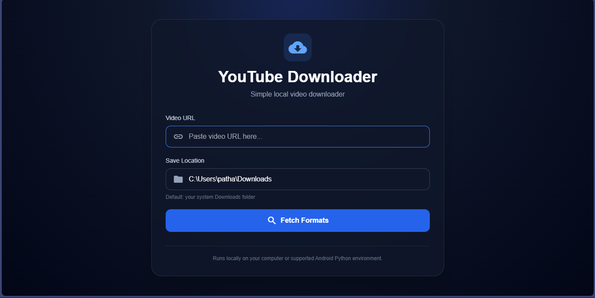
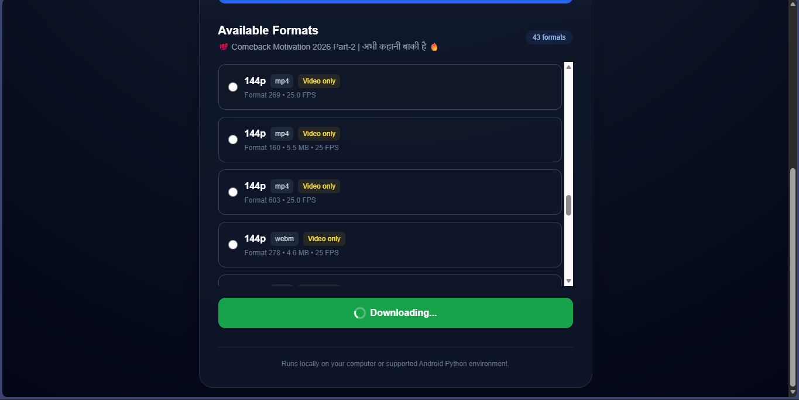

# 🎬 YouTube Video Downloader

A lightweight, cross-platform YouTube downloader built with **Python, Flask, and yt-dlp**.

The project provides a simple web interface where you can paste a YouTube URL, inspect the available formats, and download the selected media directly to your device.

> 🚧 **Current Version: V1 — Working Prototype**  
> V2 will introduce improved video/audio handling, FFmpeg integration, quality-based downloading, and a more polished download workflow.

---

## ✨ Features

- 🎥 Download YouTube media
- 🔗 Simple YouTube URL input
- 📋 Fetch available formats
- 🎚️ Select from available quality/formats
- 💾 Automatic download-folder detection
- 🖥️ Windows support
- 📱 Android/Termux support
- 🌙 Modern dark glass-style interface
- ⚡ Lightweight Flask backend
- 🐍 Built entirely with Python
- 🔒 Runs locally on your own device

---

## 📸 Screenshots

<h3>Main Interface</h3>

<p>
  
</p>

<h3>Format Selection</h3>

<p>
  
</p>


---

## 🛠️ Tech Stack

| Technology | Purpose |
|---|---|
| 🐍 Python | Core application |
| 🌐 Flask | Local web server |
| 📦 yt-dlp | YouTube media extraction/downloading |
| 🎨 HTML | User interface |
| 💨 Tailwind CSS | UI styling |
| 🔤 Material Icons | Interface icons |

---

## 📂 Project Structure

```text
youtube-downloader/
│
├── youtube_downloader.py
├── screenshots/
│   ├── main-interface.png
│   └── format-selection.png
│
└── README.md
```

---

## 🚀 Installation

### 1. Clone the repository

```bash
git clone https://github.com/YOUR-USERNAME/youtube-downloader.git
```

Move into the project directory:

```bash
cd youtube-downloader
```

### 2. Install dependencies

```bash
python -m pip install --user flask yt-dlp
```

If you already have Flask installed, that's fine — pip will simply keep the existing installation.

---

## ▶️ Run the Application

Start the application:

```bash
python youtube_downloader.py
```

You should see:

```text
* Running on http://127.0.0.1:5000
```

Open your browser and visit:

```text
http://127.0.0.1:5000
```

---

## 🎯 How to Use

### Step 1 — Open the application

Run:

```bash
python youtube_downloader.py
```

### Step 2 — Enter a YouTube URL

Paste the YouTube video URL into the input field.

Example:

```text
https://www.youtube.com/watch?v=XXXXXXXXXXX
```

### Step 3 — Fetch formats

The application retrieves the formats available for that video.

### Step 4 — Select a format

Choose the format/quality you want.

### Step 5 — Download

The downloaded file will be saved to the automatically detected download directory.

---

## 💾 Download Location

The application automatically detects the operating system.

### Windows

Downloads are saved to:

```text
C:\Users\YourUsername\Downloads
```

### Android / Termux

If the standard Android download directory is available:

```text
/storage/emulated/0/Download
```

Otherwise, the application falls back to the user's home `Downloads` directory.

---

## 🖥️ Windows

Tested workflow:

```text
Windows
   ↓
Python
   ↓
Flask
   ↓
Local Web Interface
   ↓
yt-dlp
   ↓
Downloaded Media
```

Run:

```powershell
python youtube_downloader.py
```

Then open:

```text
http://127.0.0.1:5000
```

---

## 📱 Android

The current project can also be used through an Android environment such as **Termux**, provided Python and the required dependencies are available.

Install the dependencies:

```bash
pip install flask yt-dlp
```

Then run:

```bash
python youtube_downloader.py
```

The Android download directory is detected automatically when available.

> Native Android APK support is not part of the current V1 implementation.

---

## ⚠️ Current Limitations

This is the **V1 release**, so there are some limitations.

### Video and audio may be separate

YouTube frequently provides high-quality video and audio as separate streams.

Because the current version does not yet integrate FFmpeg merging, some selected formats may contain:

- video only
- audio only

Therefore, selecting something labeled `MP4` does **not always guarantee that the downloaded file contains both video and audio**.

This is planned for V2.

---

## 🗺️ Roadmap

### ✅ V1 — Current

- [x] Flask web application
- [x] YouTube URL input
- [x] Format extraction
- [x] Format selection
- [x] Local downloading
- [x] Automatic download directory detection
- [x] Windows support
- [x] Android/Termux compatibility
- [x] Modern UI

### 🔜 V2 — Planned

- [ ] FFmpeg integration
- [ ] Automatic video + audio merging
- [ ] Quality-based downloading
- [ ] Proper MP4 output
- [ ] 360p / 480p / 720p / 1080p selection
- [ ] Best Quality option
- [ ] Better format filtering
- [ ] Download progress
- [ ] Download status
- [ ] Improved error messages
- [ ] Better mobile UI

### 🚀 Future

- [ ] Playlist support
- [ ] Audio-only downloads
- [ ] Download history
- [ ] Queue system
- [ ] Cancel downloads
- [ ] Better cross-platform support
- [ ] Standalone desktop application

---

## 🔐 Privacy

This application is designed to run locally.

The Flask server runs on:

```text
127.0.0.1
```

This means the interface is intended to be accessed from your own device rather than being exposed publicly.

No cloud backend is required for the application itself.

---

## ⚠️ Responsible Use

This project is intended for legitimate downloading and personal use.

Users are responsible for respecting:

- YouTube's Terms of Service
- Copyright laws
- The rights of content creators
- Applicable laws in their country

Only download content you have permission to download.

---

## 🧑‍💻 Development

The project is intentionally kept simple so it can be easily understood and modified.

Main application:

```text
youtube_downloader.py
```

Run it directly with:

```bash
python youtube_downloader.py
```

---

## 🤝 Contributing

Contributions, improvements, bug fixes, and ideas are welcome.

### Basic workflow

```bash
git clone https://github.com/YOUR-USERNAME/youtube-downloader.git
cd youtube-downloader
```

Create your changes, test them locally, and submit a pull request.

---

## ⭐ Support the Project

If you find this project useful:

⭐ Star the repository  
🍴 Fork the project  
🐛 Report bugs  
💡 Suggest features  
🔧 Contribute improvements

---

## 📜 License

Choose and add a license appropriate for your project before publishing.

For example:

```text
MIT License
```

---

## 👨‍💻 Author

**Satyam**

Built with Python, curiosity, and a lot of experimentation.

---

<p align="center">
  <b>🎬 Simple. Local. Lightweight.</b>
</p>

<p align="center">
  Made with 🐍 Python + Flask + yt-dlp
</p>